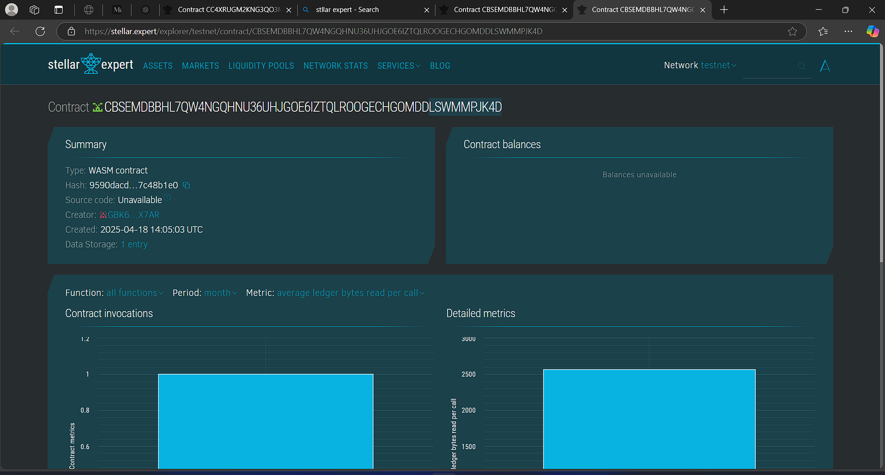

# Daily Quotes Storage DApp

## 📖 Project Description

A lightweight Soroban-based smart contract designed to store and retrieve daily motivational quotes on-chain. Each quote is timestamped with a unique day index and includes the quote text along with its author.

## 🌟 Project Vision

To inspire and empower individuals every day by providing immutable, transparent, and decentralized access to motivational content using blockchain technology.

## ✨ Key Features

- 📦 **Quote Storage**: Store daily quotes with metadata (text + author).
- 🔍 **Quote Retrieval**: Retrieve quotes by specifying the day index.
- 🕐 **Time-based Querying**: Easily fetch latest or specific day's quote.
- 📚 **Simple Interface**: Minimal design for easy integration with frontends or apps.

## 🚀 Future Scope

- 🔐 User authentication for verified quote submissions.
- 🗳️ Community voting on submitted quotes.
- 🎨 UI DApp for viewing quotes with calendar view.
- ⏳ Auto-publish scheduled quotes based on blockchain timestamp.

- contract details CBSEMDBBHL7QW4NGQHNU36UHJGOE6IZTQLROOGECHGOMDDLSWMMPJK4D
